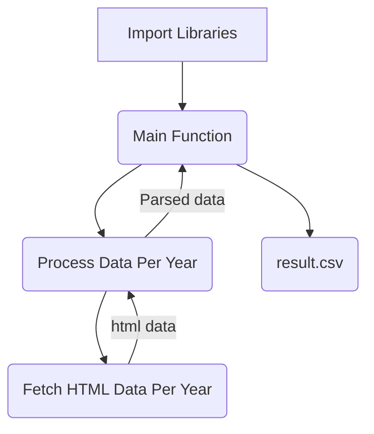

# Scraping & Consolidating data

The task is to scrap data from the "WEEKLY AVERAGE PRICES OF TOTAL TEA SOLD AT INDIAN AUCTION" table on the Tea Board of India website ([https://www.teaboard.gov.in/WEEKLYPRICES/2023](https://www.teaboard.gov.in/WEEKLYPRICES/2023)) for all available years i.e. from 2008 to 2023. The scraped data should be consolidated and stored in a CSV file with 3 columns: week (formatted as DD-MM-YYYY), location, and average_price.

## Task Steps

We are required to scrap data for every year from 2008 to 2023. After observing, it was found that base URL is the same for every year, just the year is changed at the end.

 * URL for 2008:
`https://teaboard.gov.in/WEEKLYPRICES/2008`

* URL for 2014:
`https://teaboard.gov.in/WEEKLYPRICES/2014`

* URL for 2023:
`https://teaboard.gov.in/WEEKLYPRICES/2023`

Steps for scraping and consolidating data:

1. The first step is to import the requisite libraries: **requests,  beautifulsoup, pandas and datetime**. 
2. Then, the **main function** is called. Here, *datetime* library is used to find the current date, hence able to find the current year. This is done to not limit the code for 2023.
3. From the main function, calls are made iteratively to another function to **process the data for every year**. 
4. Now, to process data per year, **fetching** has to be done for the data. So, another function is called which fetches the HTML data from the website using the *requests* library.
5. This data is then brought back for processing and is parsed using *beautifulsoup* library. 
6. This parsed data is then stored in the form of an array in a global variable. 
7. Now, come back to the main function and import all data into the dataframe created using *pandas* library. Then the data is transfered into **results.csv** file.

# Flow Diagram

